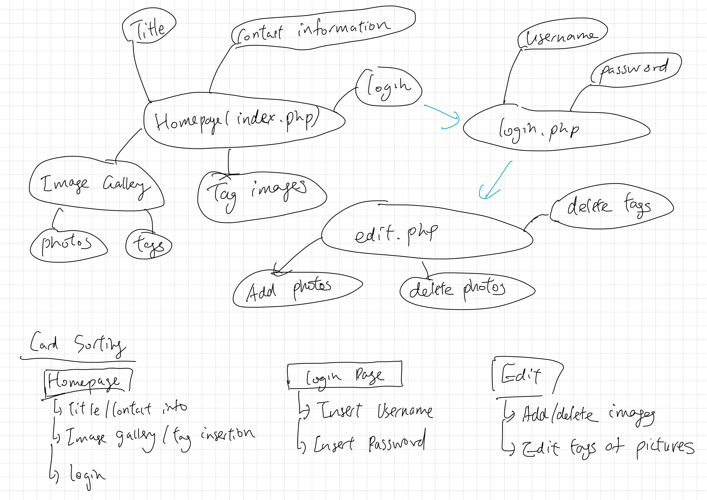
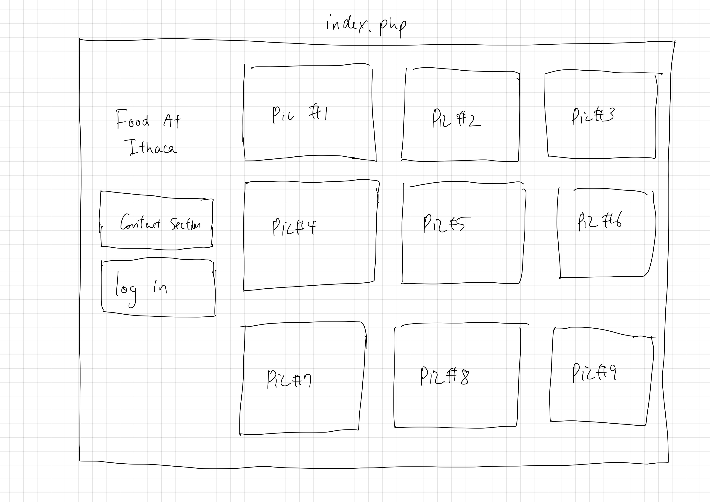
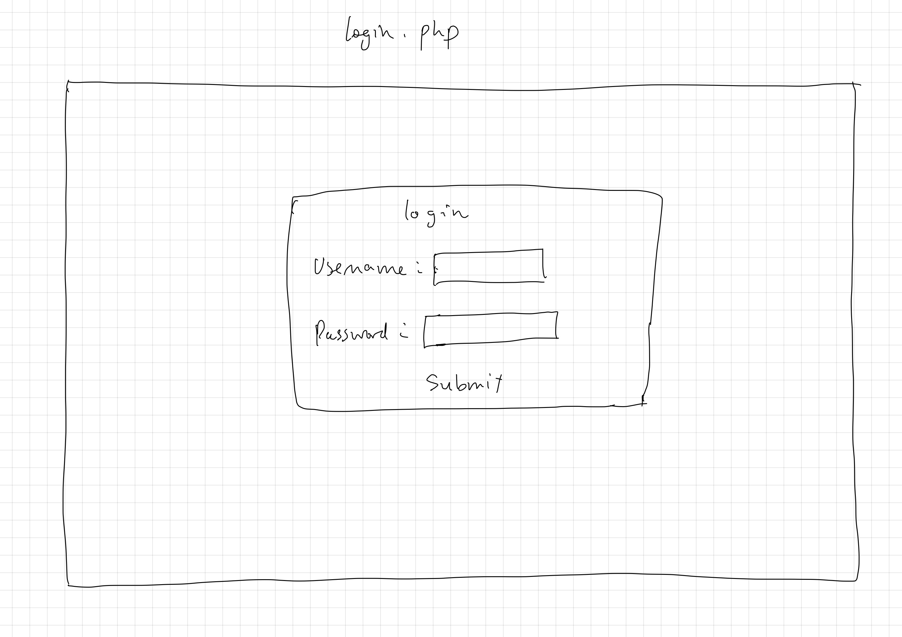
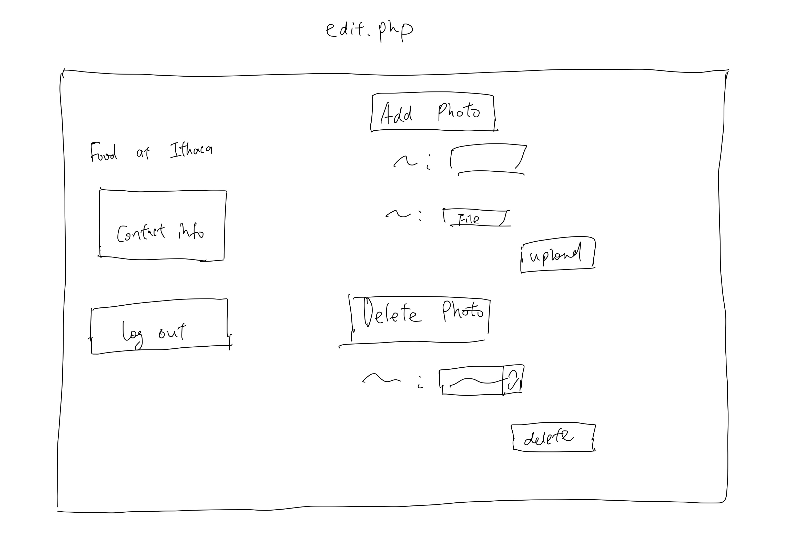
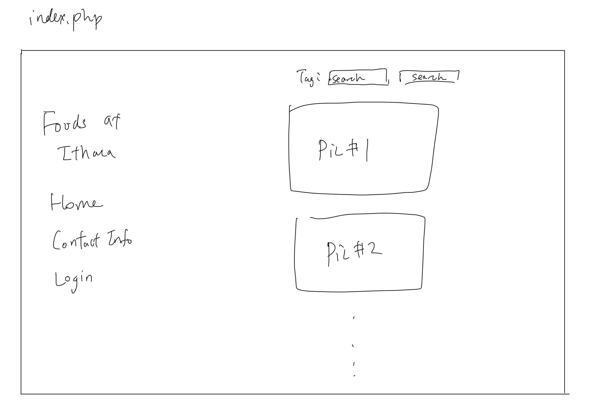
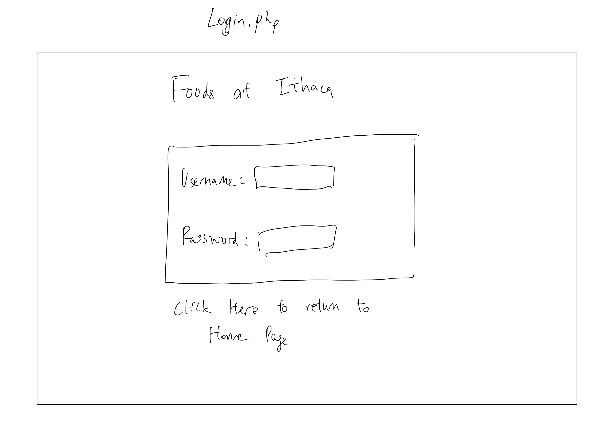
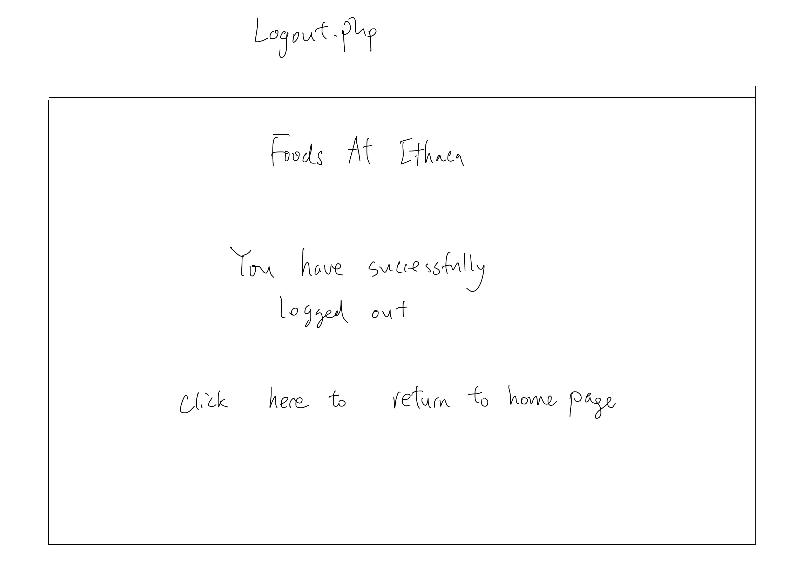
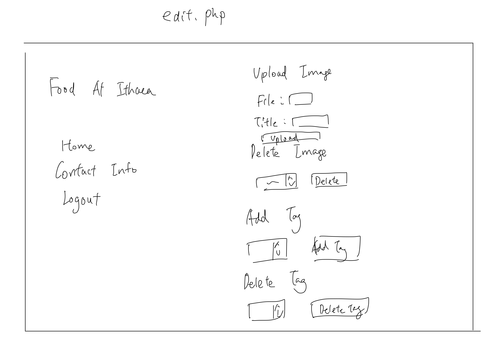

# Project 3: Design Journey

Your Name: Toshi Tokuyama

**All images must be visible in Markdown Preview. No credit will be provided for images in your repository that are not properly linked in Markdown. Assume all file paths are case sensitive!**


# Project 3, Milestone 1 - Design, Plan, & Draft Website

## Describe your Gallery

[What will your gallery be about? 1 sentence.]

The image gallery will be about foods that can be found at Ithaca.

## Target Audiences

[Tell us about your target two audiences. ~1-3 sentences per audience]

The first target audience are for tourists who visit Ithaca. The image gallery will be suited for such target audience because the tourists may have no knowledge about the locations to eat at Ithaca, and would therefore be a useful source of information.

The second target audience are students at Cornell University who may be exploring new places to eat. The image gallery will be useful because it can provide new options to students who may never knew the restaurants before.

## Design Process

[Document your design process. Show us the evolution of your design from your first idea (sketch) to design you wish to implement (sketch). Show us the process you used to organize content and plan the navigation (e.g. card sorting).]

[Label all images. All labels must be visible in Markdown Preview.]


The content of the website was created by indentifying the necessary webpages (index, login-page, edit-page) for the website and organizing the content according to the pages. I first started with creating a diagram about the components that can be included in the potentional pages. After coming up with the ideas and content, I organized the contents according to the pages. The conent of the pages were created by sorting the smaller ideas into broader ideas where many contents can fit.


I decided to include the photo gallery in my homepage because I believed such formatting would decrease the amount of work done by the user to access the photo gallery. Sticking the photo gallery into the index page would also be aesthetically pleasing because it would include a mix of colors and visuals.


The login page only includes the part where the user types the username and password. Having this element in a seperate page allows the user to easily recognize the purpose of the page.


I included the insertion and the deletion section on the same page to create usabiity which can appeal to the users.

## Final Design Plan

[Include sketches of your final design here.]






For my final design I decided to include a logout page so that the users can have a clear idea when they are logged out from the photo gallery.

## Templates

[Identify the templates you will use on your site.]

The templates that I will use are the contact template which will include the contact information,and the head template which will display the title of the website and the CSS link.

## Database Schema Design

[Describe the structure of your database. You may use words or a picture. A bulleted list is probably the simplest way to do this. Make sure you include constraints for each field.]

[Hint: You probably need `users`, `images`, `tags`, and `image_tags` tables.]

[Hint: For foreign keys, use the singular name of the table + _id. For example: 1) `user_id` in the `images` table or 2) `image_id` and `tag_id` for the `image_tags` table.]

Table: users

* field 1: id, Integer {Primary key, unique, not null, autoincrement}
* field 2: username, Text {unique, not null}
* field 3: password, Text {not null}

Table: images

* field 1: id, Integer {Primary key, unique, not null, autoincrement}
* field 2: image_name, Text {not null}
* field 3: title, Text {not null}
* field 4: users_id, Integer {not null} (foreign key)

Table: tags

* field 1: id, Integer {Primary key, unique, not null, autoincrement}
* field 2: tag, Text {not null}

Table: image_tags

* field 1: id, Integer {Primary key, unique, not null, autoincrement}
* field 2: images_id, Integer (foreign key)
* field 3: tags_id, Integer (foreign key)

Table: session

* field1: id, Integer {Primary key, unique, not null, autoincrement}
* field2: users_id {unique, not null} (foreign key)

## Code Planning

[Plan what top level PHP pages you'll need.]
init.php will be my top-level PHP page as the functions used for all pages would be included inside there.

[Plan what templates you'll need.]

sidebar template

* Has the title of the website

* Contact information

* Navigation of the website
  * Link to homepage
  * Login page

contact template

* Has the email link to contact for more information

head template

* includes link to css
* title of website (title displayed on web)

[Plan any PHP code you'll need.]

//Function for when user is logged in
```
function is_user_logged_in() {
  if user is logged in, return true
  otherwise, return false
}
```

//Function for when is logged out
```
function logout(){
  if user presses logout button{
    return to main page && logout;
  }
}
```

//Function for changing navigation
```
function page_identify{
  if (page is index.php and user is logged in){
    add link to edit.php;
  } else if (page is index.php) {
    add link to login.php
  } else {
    add link to logout.php;
  }
}
```

Filter the uploaded image and add it to the uploads/documents file
```
if(isset($_POST["submit_image"])){
  save the image file into a variable/ filter input for Title/ if there is no error, proceed
  if(no error){
    save the name of image file into variable
    save the extension of image file into variable
    sql query that inserts the new uploaded image into images
    //If the sql query returns a result
    if($result) {
      get the id of the last file
      check if file is moved into correct directory
    }
  }
}
```

Deleting Image
```
if(isset($_POST["delete_image"])){
  filter input for the selected image to delete
  sql query to delete the image from disk
  get path to file and use unlink to delete image
  sql query to delete the image from the images table
  sql query to delete the image from the image_tags table
}
```

//Show all the images in images table
```
sql query: $sql = "SELECT * FROM images";
$records = exec_sql_query($db, $sql, $params)->fetchAll(PDO::FETCH_ASSOC);
foreach ($records as $record) {
  print the title
  show the images
}
```

## Database Query Plan

[Plan your database queries. You may use natural language, pseudocode, or SQL.]

1. Return all records and field from the table.

SQL: SELECT * FROM (table)

2. Searching records by tag

Get the id of the entry in tags table:
SQL: "SELECT * FROM tags WHERE tag = 'tags.id'";

Return only the images that the user uploaded
SQL: "SELECT * FROM images WHERE user_id = 'current_user_id'";

3. searching records by username

Return the password which matches the username, and check if the password and username matches. If so,login the user.

4. Insert into database

SQL: "INSERT INTO images (image_name, image_ext, title, user_id) VALUES ('image_name', 'image_ext', 'title', 'user_id')";

SQL: "INSERT INTO tags (tag) VALUES ('new_tag')";

5. Delete from databse
SQL: "DELETE FROM images WHERE id = 'delete_image_id'";


# Project 3, Milestone 2 - Gallery and User Access Controls

## Issues & Challenges

[Tell us about any issues or challenges you faced while trying to complete milestone 2. 2-4 sentences/bullet points]

Incororating the login to fit into my website was a challenge because I had to make some modification. Another error that I struggled was to find the small errors such as misspelling. Since these errors do not show in the output or console, it takes time and a lot of effort to fix these small errors.


# Final Submission: Complete & Polished Website

## Reflection

[Take this time to reflect on what you learned during this assignment. How have you improved since starting this class? 2-4 sentences]

For project 3, the main technique I learned was using PHP and SQL to create a website that is backed up by a database. I have improved my programming skills significantly compared to when the semester began because project 3 required more complex programming skills compared to other projects. Furthermore, I believe I have also improved my ability to organize and make plans because complex websites require more planning.
